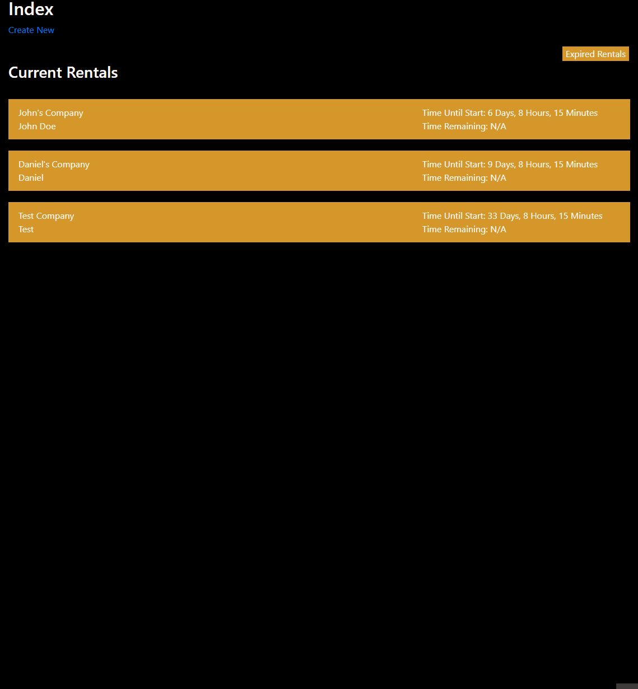
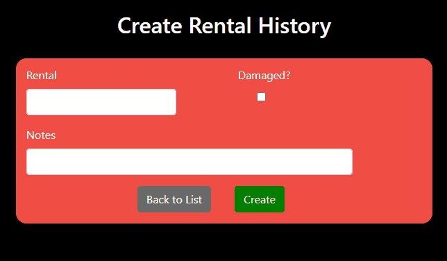

# Introduction
As part of the Software Developer Boot Camp at The Tech Academy, I was able to work on a Live Project for C# and the .NET Framework for two weeks. For this project specifically, we utilized ASP.NET MVC and Entity Framework, with a code-first database. We also used Bootstrap for the front end. The goal of the project was to help develop a website for a theater production company based in Oregon. The website was to be designed such that the theater company could easily manage their company needs, such as accepting and keeping track of equipment rentals and donations, managing subscriber information, and other related services. For my part, I was mainly tasked with implementing CRUD functionality to keep track of both equipment rental requests as well as a history of equipment rentals. I was also tasked with styling and improving the user experience for these pages on the front end as well.

Throughout our time on the project, we practiced the Agile/Scrum methodology. As part of this process, each student was assigned user stories. Similar to the Python Live Project that I also participated in, these stories gave us specific tasks to accomplish in order to aid in the creation of this website. The stories were all viewable on Azure DevOps, which we used to coordinate our efforts. It is important to note that we were not explicitly told how to actually accomplish each story, and needed to do some measure of outside research and individual testing in order to complete our tasks. The purpose of this was to facilitate learning, and as such I feel that it was very helpful for me.

Below I have included parts of code I actually wrote while on this project, along with explanations of how and why I implemented each feature.

# Back-End
- ## Entity Models
  During my time on the project, I had to create two seperate entity models (utilizing the Entity framework): one for keeping track of equipment rental requests,     and another for keeping a history of equipment rentals and any pertinent information. The models I created are shown below.
  
  Here is the model for rental requests:
  
  ```
  namespace TheatreCMS3.Areas.Rent.Models
  {
    public class RentalRequest
    {
        public int RentalRequestID { get; set; }
        public string ContactPerson { get; set; }
        public string Company { get; set; }
        public DateTime RequestedTime { get; set; }
        public DateTime StartTime { get; set; }
        public DateTime EndTime { get; set; }
        public string ProjectInfo { get; set; }
        public int RentalCode { get; set; }
        public bool Accepted { get; set; }
        public bool ContractSigned { get; set; }
    }
  }
  ```

  Here is the model for Rental History:

  ```
  namespace TheatreCMS3.Areas.Rent.Models
  {
      public class RentalHistory
      {
          public int RentalHistoryId { get; set; }
          public bool RentalDamaged { get; set; }
          public string DamagesIncurred { get; set; }
          public string Rental { get; set; }
      }
  }
  ```
  
  After this was done, all I needed to do was add my new models to the IdentityModels.cs file for the project:
  
  ```
  public System.Data.Entity.DbSet<TheatreCMS3.Areas.Rent.Models.RentalRequest> RentalRequests { get; set; }
  ```
  
  ```
  public System.Data.Entity.DbSet<TheatreCMS3.Areas.Rent.Models.RentalHistory> RentalHistory { get; set; }
  ```
  
  Then, once I built and ran the project, database tables were automatically created based on these models. This would allow us to keep track of the information and   store it for retrieval later.
  
- ## CRUD Pages/Functionality
  After creating the entity models, I needed to scaffold the CRUD pages using Entity Framework. As part of this process, I was given instructions to use the Layout   file for the site, which was created beforehand. After scaffolding the pages, I was left with a create, edit, details, delete, and index page for both Rental       Requests and Rental History. Here is an example of a scaffolded Rental History details page:
  
  ```
  @model TheatreCMS3.Areas.Rent.Models.RentalHistory

  @{
    ViewBag.Title = "Details";
    Layout = "~/Views/Shared/_Layout.cshtml";
  }

  <h2>Details</h2>

  <div>
      <h4>RentalHistory</h4>
      <hr />
      <dl class="dl-horizontal">
          <dt>
              @Html.DisplayNameFor(model => model.RentalDamaged)
          </dt>

          <dd>
              @Html.DisplayFor(model => model.RentalDamaged)
          </dd>

          <dt>
              @Html.DisplayNameFor(model => model.DamagesIncurred)
          </dt>

          <dd>
              @Html.DisplayFor(model => model.DamagesIncurred)
          </dd>

          <dt>
              @Html.DisplayNameFor(model => model.Rental)
          </dt>

          <dd>
              @Html.DisplayFor(model => model.Rental)
          </dd>

      </dl>
  </div>
  <p>
      @Html.ActionLink("Edit", "Edit", new { id = Model.RentalHistoryId }) |
      @Html.ActionLink("Back to List", "Index")
  </p>
  ```
  
  By now, I had implemented both the models, as well as created CRUD pages for each of them. At this point, these pages were fully functional, and were able to       create, read, update, and delete items from the database. After creating the models and scaffolding the views, I was also tasked with styling the front end to       make it more attractive and create a better user experience.
  
# Front-End
- ## Rental Requests
  I was eventually tasked with making the Rental Requests Index page look better by turning the default display into an accordion. To do this, I needed to utilize     both CSS and JavaScript to achieve the desired effect. Additionally, the entries making up the accordion were to be sorted by start date in ascending order.         There also needed to be a button on the page that toggled between displaying current rental requests and those where over a week had passed since they               ended. Here is the final product:
  
  
  
  There was a lot of CSS needed to achieve the look of the page, but I won't go into much detail here since it's relatively mundane. The main thing to note is that   I used Bootstrap's grid system in order to position a lot of the elements, as well as `display: flex;` using CSS. The JavaScript, however, was a little more         involved. To achieve the dropdown effect of the accordion, I used this code:
  
  ```
  var acc = document.getElementsByClassName("RentalRequest-Index--accordion");
  var i;

  for (i = 0; i < acc.length; i++) {
      acc[i].addEventListener("click", function () {
          this.classList.toggle("active");

          var panel = this.nextElementSibling;
          if (panel.style.maxHeight) {
              panel.style.maxHeight = null;
          } else {
            panel.style.maxHeight = panel.scrollHeight + "px";
          }
      });
  }
  ```
  
  To add the functionality of the button to toggle between current and expired rental requests, I used if/else statements to simply either display or hide the         current/expired rental requests depending on the state of a boolean value corresponding to what was being shown. Finally, to ensure that the expired rental         requests were not shown when first visiting the page, I added a simple function to hide the expired requests, and called it when the page loaded like this:
  
  ```
  window.addEventListener('load', function () {
    loadDisplay();
  });
  ```
  
  The Index.cshtml file was already scaffolded for me, but I had to then add additional logic to the file using Razor syntax, such as this:
  
  ```
  @foreach (var item in Model.Where(i => ((i.EndTime.AddDays(7)) > (DateTime.Now))).OrderBy(i => i.StartTime))
  ```
  
  I also had to do some minor conversions in order to accurately represent the time remaining on the rental requests:
  
  ```
  <!--Using .Ticks to properly convert to DateTime-->
            @{
                DateTime startTime = new DateTime(item.StartTime.Ticks);
                var timeUntilStart = startTime - DateTime.Now;

                DateTime endTime = new DateTime(item.EndTime.Ticks);
                var timeRemaining = endTime - DateTime.Now;
            }
  ```
  
  The rest of the work I did mostly involved adding classes to various HTML elements as well as creating more if/else statements to make sure nothing was displayed   incorrectly.
  
- ## Rental History
  For Rental History, I was tasked with something a bit different. I was to style the create and edit pages for rental histories, and dynamically update text on the pages depending on the state of a checkbox. Below you can see the result:
  
  
  
  This form mainly utilized Bootstrap and custom CSS to achieve the final appearance. However, as with the accordion I just detailed before this, the JavaScript was the important part. This time, though, the process was a bit simpler:
  
  ```
  // Create/Edit Rental History page

  function toggleNotes() {
      var label = document.getElementById("RentalHistory-Create--label");
      var checkbox = document.getElementById("RentalHistory-Create--checkbox");

      if (checkbox.checked) {
          label.innerHTML = "Damages Incurred";
      }
      else if (!checkbox.checked) {
          label.innerHTML = "Notes";
      }
  }
  ```
  
  This code alone would work for the Create page, but I quickly realized that I would need to make a minor adjustment for the Edit page. Since the function was only   being called when the HTML element was being clicked on, if a user decided to edit an already existing item, the checkbox could already be checked. Therefore,       "Damages Incurred" would not be displayed until the user clicked on the checkbox twice in this instance, which was clearly not desired. To fix this, I also had     the function be called on page load:
  
  ```
  window.addEventListener('load', function () {
    toggleNotes();
  });
  ```
  
  This made the feature work as intended.
  
  As an additional note, I was also tasked with styling the Donation page form, but it was very similar in appearance to the Rental History form shown above, so I     will not go into detail about it here.
  
# Conclusions/Takeaways
This was the second Live Project I participated in as part of my curriculum at The Tech Academy, the first being the Python Live Project. As a result, I came into this project feeling much more prepared, and overall, I feel that it went more smoothly. However, that is not to understate how helpful this Live Project was as well. Working with a completely different language from the last project really helped to reinforce the process of software development, but from a slightly different perspective. I also feel that I learned just as much, if not more, than the previous project. Not only did I learn more about and improve my C# skills, but I also gained more knowledge about ASP.NET, Entity Framework, and several other useful tools and technologies. I am really grateful to have had the opportunity to undertake two separate Live Projects, and feel much more confident in my skills as a developer because of it.

  
  
  
  
